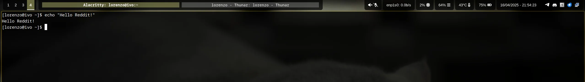

# waybar-groupie



A [waybar custom module](https://github.com/Alexays/Waybar/wiki/Module:-Custom#module-custom-config-return-type) to show [Hyprland's grouped](https://wiki.hyprland.org/Configuring/Window-Rules/#group-window-rule-options) window titles.

Author's disclaimer: This widget has been coded as an hobby project during my spare time for personal use, bugs and incompatibilities with various issue may come up. Feel free to open an issue or to contribute!

# Installation

Groupie must be currently built from source:

```bash
cargo build --release
```

Then you can move the resulting ```target/release/waybar-groupie``` binary whenever you prefer and add it to waybar's configuration as follows:

```json
"custom/windows_widget": {
        "return-type": "json",
        "exec": "WAYBAR_GROUPIE_BINARY"
    }
```

```"custom/windows_widget"``` must be added to the desired ```modules-*``` list as well.

# Configuration

The configuration is read from a JSON file. Below are the details for each configurable option:

### `separator`
- **Type**: `string`
- **Description**: The string used to separate different window titles. This can be customized to fit specific visual or functional requirements.

### `socket_address`
- **Type**: `string`
- **Description**: The address of the Hyprland socket to which the application will bind. Should be left empty in the majority of cases as it fetched from env by default.

### `empty_text`
- **Type**: `string`
- **Description**: The text displayed when there is no window opened. This can be used to provide user-friendly messages when the application is in an empty state.

### `width`
- **Type**: `int`
- **Description**: The width of the widget area in terms of the number of characters. Adjusting this value will may be useful to avoid overlapping.

### `line_height`
- **Type**: `float`
- **Description**: The height of the text line, useful to add a bit of vertical padding.

### `active_background_color`
- **Type**: `string`
- **Description**: The background color used for the active window title.

### `background_color`
- **Type**: `string`
- **Description**: The background color for inactive window titles. 

### Example JSON Configuration

Below is an example of what the JSON configuration file might look like:

```json
{
    "separator": " ||",
    "empty_text": "",
    "width": 100,
    "line_height": 1.0,
    "active_background_color": "#ffffff66",
    "background_color": "#99999966"
}
```

The default path to load configuration is ```.config/groupie/config.json```, but it can be overriden by setting the env variable ```GROUPIE_CONFIG_PATH```.

# Miscellaneous tips
## Monitor and/or ambient specific configurations
Due to how waybar's custom modules work, the only way is to specify adaptive configurations is to dynamically generate them and override the ```GROUPIE_CONFIG_PATH``` at startup. 
For instance, this can be achieved through the ```envsubst``` command:

```
export GROUPIE_WIDTH=55
export GROUPIE_CONFIG_PATH="/home/lorenzo/.config/groupie/config_edp1.json"
cat template_config.json | envsubst > "${GROUPIE_CONFIG_PATH}"
```

In this example the ```template_config.json``` looks like this:

```
{
    "separator": " ",
    "active_background_color": "#ffff9955",
    "width": ${GROUPIE_WIDTH}
}
```

While the `separator` and the `active_background_color` are common, the `width` value is fetched from the environment by `envsubst` replaced in the file and written to `GROUPIE_CONFIG_PATH`.

